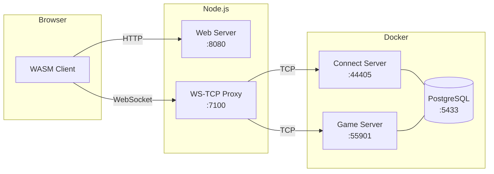

# OpenMU Browser Stack

MU Online in the browser. Server-side infrastructure to run MU Online via WebAssembly, using [OpenMU](https://github.com/MUnique/OpenMU) as the game server.

## What is this

Everything you need on the server side to bridge a WASM MU client to OpenMU:

- **Game Server** — OpenMU (C#/.NET) running via Docker with PostgreSQL
- **WebSocket-TCP Proxy** — Bridge between the browser (WebSocket only) and OpenMU (TCP)
- **Web Server** — Serves the WASM client with required headers (COOP/COEP)
- **HTML Template** — Ready to receive a compiled WASM client



**Connection flow:**
1. Client opens WebSocket to proxy → proxy connects TCP to Connect Server (:44405)
2. Connect Server sends ConnectionInfo (`C1 F4 03`) with Game Server IP:port
3. Proxy rewrites the IP:port to its own address, stores the real target
4. Client reconnects via WebSocket → proxy routes TCP to Game Server (:55901)

## Status

| Component | Status |
|-----------|--------|
| WebSocket-TCP Proxy | Implemented, not tested end-to-end |
| Web Server (static + COOP/COEP) | Implemented |
| MU Packet Parser (C1/C2/C3/C4) | Implemented |
| ConnectionInfo Rewriter (F4 03) | Implemented |
| OpenMU via Docker | Configured |
| **WASM Client** | **Pending** — see [WASM Client](#wasm-client) |

> **Note:** No compatible WASM client exists yet. The proxy and packet parser are implemented but have not been tested with a real game session.

## Quick Start

### Prerequisites

- Node.js 22+
- Docker and Docker Compose

### 1. Clone and install

```bash
git clone https://github.com/your-username/openmu-browser-stack.git
cd openmu-browser-stack
npm install
cp .env.example .env
```

### 2. Start OpenMU

```bash
docker compose up -d
```

This starts:
- **PostgreSQL 16** on port 5433
- **OpenMU** with auto-start
  - Admin panel: http://localhost:8090
  - Connect Server: port 44405
  - Game Servers: ports 55901-55906
  - Chat Server: port 55980

### 3. Start the proxy and web server

```bash
npm start
```

Or separately:

```bash
npm run proxy   # WebSocket proxy on port 7100
npm run serve   # Web server on port 8080
```

### 4. Open

Go to http://localhost:8080. You will see a placeholder page — the WASM client is not included. See [WASM Client](#wasm-client) for the next step.

## WASM Client

This repository **does not include** the game client. You need to compile a MU Online client to WebAssembly.

### Recommended client: MuMain

[sven-n/MuMain](https://github.com/sven-n/MuMain) is the best candidate:

- **C++ with OpenGL** — Emscripten maps OpenGL ES to WebGL natively
- Compatible with OpenMU (standard MU protocol C1/C2/C3/C4)

### Required work

| Task | Description |
|------|-------------|
| OpenGL 1.x → OpenGL ES 2.0 | Replace `glBegin`/`glEnd` with VBOs + GLSL ES shaders |
| Networking .NET → C++ | Rewrite `ClientLibrary` (.NET AOT) in pure C++ |
| Win32 → SDL2/Emscripten | Replace `windows.h` with SDL2 (cross-platform) |
| Audio → Web Audio | Replace DirectSound/wzAudio with OpenAL or SDL_mixer |
| Game loop | Adapt to `emscripten_set_main_loop()` |
| Assets | Package BMD/OZJ/OZB into Emscripten's `.data` file |

### Integrating the compiled client

1. Compile with Emscripten (outputs `.js`, `.wasm`, `.data`)
2. Copy to `public/`
3. Add `<script async src="YourClient.js"></script>` to `public/index.html`
4. `Module.websocket.url` already points to the proxy (`ws://127.0.0.1:7100`)

## MU Online Protocol

The proxy understands MU packet framing:

| Header | Size | Encryption |
|--------|------|------------|
| `C1` | 1 byte (max 255) | None |
| `C2` | 2 bytes BE (max 65535) | None |
| `C3` | 1 byte | SimpleModulus / XOR32 |
| `C4` | 2 bytes BE | SimpleModulus / XOR32 |

The proxy is transparent to encryption. The only exception is the **ConnectionInfo** packet (`C1 F4 03`), whose IP:port is rewritten to redirect connections through the proxy.

## Structure

```
openmu-browser-stack/
├── docker-compose.yml          # OpenMU + PostgreSQL
├── .env.example                # Configuration template
├── package.json
├── public/
│   └── index.html              # HTML template for the WASM client
└── src/
    ├── proxy/
    │   ├── index.js            # Proxy entry point
    │   ├── ws-server.js        # WebSocket↔TCP bridge
    │   ├── tcp-client.js       # TCP client wrapper
    │   ├── packet-parser.js    # MU packet framing (C1/C2/C3/C4)
    │   └── packet-rewriter.js  # ConnectionInfo (F4 03) rewriter
    └── web/
        └── server.js           # Static file server
```

## Configuration

Copy `.env.example` to `.env`:

| Variable | Default | Description |
|----------|---------|-------------|
| `WS_PORT` | 7100 | WebSocket proxy port |
| `WEB_PORT` | 8080 | Web server port |
| `MU_CONNECT_HOST` | 127.0.0.1 | Connect Server host |
| `MU_CONNECT_PORT` | 44405 | Connect Server port |
| `MU_GAME_HOST` | 127.0.0.1 | Game Server host (for IP remapping) |
| `PROXY_PUBLIC_HOST` | 127.0.0.1 | Proxy public IP |

## Troubleshooting

**Port 7100 in use (macOS):** Disable AirPlay Receiver in System Settings → General → AirDrop & Handoff, or change `WS_PORT`.

**OpenMU won't start:** `docker compose down -v && docker compose up -d` to clean up and restart.

## License

MIT
